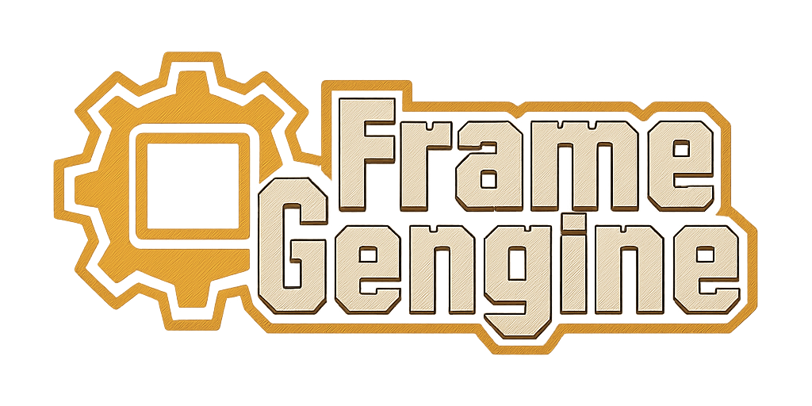
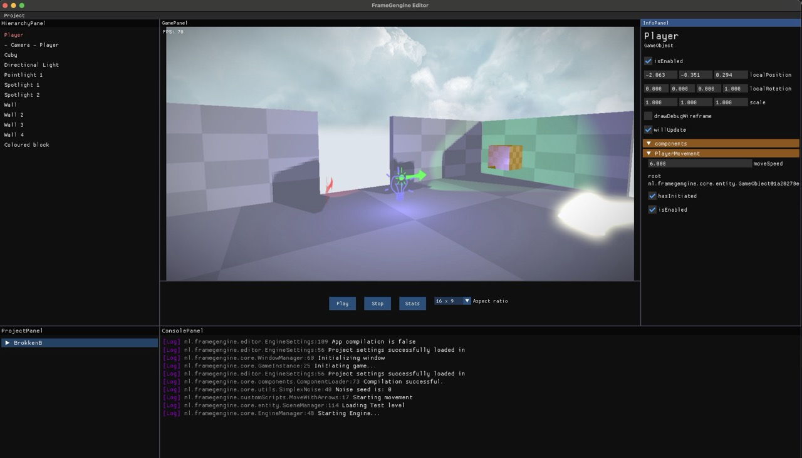

# Frame Gengine

A simple Java Game engine using LWJGL 3 and OpenGL

---

## About The Project

Frame Gengine is a personal project built from the ground up as a passion project to learn 3D game engine development. It includes several rendering techniques and a simple editor for scene editing.

The demo below showcases a procedurally generated world using the **[Marching Cubes](https://en.wikipedia.org/wiki/Marching_cubes)** algorithm. This process runs on a separate thread to ensure smooth performance during chunk generation. Of course, all using Frame Gengine!

## Gallery

The previews below might be outdated compared to the latest features.

<em>Procedural world generation with PBR lighting and shadows.</em>

 

<em>The simple built-in editor.</em>

---

### Disclaimer
This project is in the early stages of development and is not battle-tested. It does not have a stable version and likely contains bugs. It is primarily a learning project and can contain breaking changes over its lifetime.

---

## Features

| Rendering Features    | Engine & Editor |
|:----------------------| :-- |
| ✅ 3D Rendering        | ✅ Simple Editor |
| ✅ Instanced Rendering | ✅ Game Object / Component System |
| ✅ PBR Lighting        | ✅ Debug Wireframe Rendering |
| ✅ Directional Shadows | ✅ Simple UI System |
| ✅ Custom Shaders      | |
| ✅ Fog                 | |
| ✅ Post-processing     | |
| ✅ Text / UI rendering | |

### Planned Features
-   Point & Spotlight Shadows
-   Collision Detection
-   Screen-Space Ambient Occlusion (SSAO)
-   Screen-Space Reflections (SSR)
-   Expanded UI (Buttons, etc.)
-   Audio System
-   Occlusion Culling

---

## Getting Started

### How to Run
1.  Clone the repository.
2.  Open the project in your favorite Java IDE.
3.  Run the `Editor/EditorLauncher.java` file.
4.  **If on macOS**, add the `-XstartOnFirstThread` VM parameter to your run configuration.

---

## Contributing
Contributions are welcome! If you'd like to contribute, please feel free to make a fork and submit a pull request.

1. Fork the project
2. Create feature Branch (`git checkout -b feature/MyNewFeature`)
3. Commit and push changes (`git commit -m 'Added MyNewFeature'`)
4. Open pull request

---

## Credits
*   Font rendering approach inspired by [Thin Matrix's font rendering tutorial](https://www.youtube.com/watch?v=mnIQEQoHHCU).
